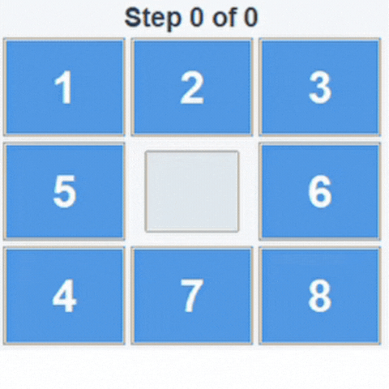
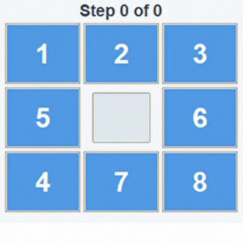
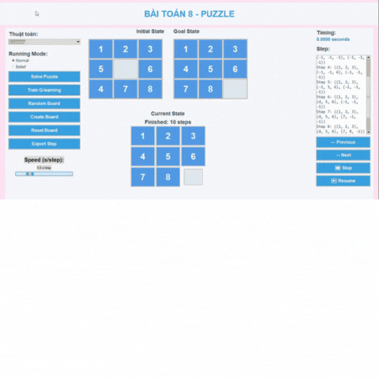

# Áp dụng các thuật toán tìm kiếm và tối ưu để giải bài toán 8 puzzle
# 1. Tổng quan về đề tài
# 1.1. Tổng quan về bài toán 8 puzzle

Bài toán 8 puzzle là một trò chơi xếp số trên lưới 3x3, bao gồm 8 ô số (từ 1 đến 8) và 1 ô trống. Mục tiêu của trò chơi là di chuyển các ô số từ trạng thái ban đầu đến trạng thái mục tiêu, thường là dạng xếp theo thứ tự tăng dần: 1-2-3, 4-5-6, 7-8-trống, bằng cách trượt ô trống lên, xuống, trái hoặc phải. Trò chơi này là một bài toán cổ điển trong trí tuệ nhân tạo, yêu cầu tìm kiếm và tối ưu hóa để xác định cách di chuyển các ô số sao cho đạt được mục tiêu trong số các bước di chuyển hợp lý.

# 1.2. Mục đích 
Dự án này áp dụng các thuật toán tìm kiếm và tối ưu trong trí tuệ nhân tạo để giải quyết bài toán 8 puzzle, với mục đích tối ưu hóa quá trình tìm kiếm và giải quyết vấn đề. Cụ thể, dự án triển khai một loạt các phương pháp tìm kiếm, bao gồm: Tìm kiếm không có thông tin (Uninformed Search), Tìm kiếm có thông tin (Informed Search), Tìm kiếm cục bộ (Local Search), Tìm kiếm trong môi trường phức tạp (Complex Environments), Tìm kiếm có ràng buộc (CSPs), và Học tăng cường (Reinforcement Learning - Đang trong quá trình hoàn thiện). Mỗi phương pháp sẽ được minh họa bằng các hình ảnh trực quan (GIF) và biểu đồ hiệu suất, giúp người học hiểu rõ hơn về cách thức hoạt động của các thuật toán trong một môi trường tĩnh và xác định của trò chơi 8 puzzle. Mục tiêu của dự án là tối ưu hóa hiệu suất và nâng cao khả năng giải quyết bài toán trong các tình huống khác nhau.

# 1.3. Cấu trúc Thư mục
- `__pycache__/` : Thư mục chứa các file bộ nhớ đệm của Python (tự động tạo).
- `algorithms/` : Chứa mã nguồn của các thuật toán tìm kiếm.
- `assets/` : Chứa các file GIF
- `draw_map.py`: Chứa mã nguồn để vẽ bản đồ (hoặc cấu trúc trò chơi).
- `main.py`: File chính để chạy chương trình.
- `q_table.pkl`: File lưu trữ bảng Q trong thuật toán học tăng cường.
- `steps_output.txt`: File lưu trữ các bước đầu ra của thuật toán.
- `utils.py` : Chứa các hàm tiện ích hỗ trợ các phần khác trong chương trình.

# 1.4. Không gian trạng thái

- Tổng số cấu hình có thể: \(9! = 362,880\), nhưng chỉ một nửa (181,440) là khả thi do tính chất hoán vị chẵn/lẻ của bài toán.
- Mỗi trạng thái có tối đa 4 hành động (di chuyển ô trống), dẫn đến một đồ thị trạng thái với độ sâu tối đa khoảng 31 bước trong trường hợp xấu nhất.

# 1.5. Độ phức tạp

- **Thời gian**: Phụ thuộc vào thuật toán, từ \(O(b^d)\) (với \(b\) là độ nhánh, \(d\) là độ sâu) cho tìm kiếm mù đến \(O(n)\) cho các phương pháp heuristic tối ưu.
- **Không gian**: Từ \(O(d)\) cho các phương pháp tiết kiệm bộ nhớ đến \(O(b^d)\) cho các thuật toán lưu toàn bộ trạng thái.

# 1.6 Tính chất

- **Tĩnh**: Môi trường không thay đổi trong quá trình giải.
- **Xác định**: Mỗi hành động dẫn đến một kết quả duy nhất.
- **Rời rạc**: Không gian trạng thái và hành động là hữu hạn.
- **Khả thi**: Không phải mọi cấu hình ban đầu đều có thể đạt được mọi cấu hình mục tiêu (phụ thuộc vào tính chẵn/lẻ của hoán vị).

---
# 2. Nội dung
## 2.1. Tìm kiếm không có thông tin (Uninformed Search)
### 
 Tìm kiếm không có thông tin (Uninformed Search) bao gồm các thuật toán tìm kiếm không sử dụng bất kỳ thông tin bổ sung nào ngoài các trạng thái hiện tại. Các thuật toán trong nhóm này bao gồm:
+ BFS (Breadth-First Search): Tìm kiếm theo chiều rộng, mở rộng tất cả các nút ở một độ sâu nhất định trước khi chuyển sang độ sâu tiếp theo.
+ DFS (Depth-First Search): Tìm kiếm theo chiều sâu, mở rộng các nút từ điểm bắt đầu đi sâu vào mỗi nhánh trước khi quay lại.
+ UCS (Uniform Cost Search): Tìm kiếm theo chi phí đồng nhất, ưu tiên mở rộng các nút có chi phí thấp nhất.
+ IDS (Iterative Deepening Search): Tìm kiếm chiều sâu lặp lại, kết hợp giữa tìm kiếm theo chiều sâu và tìm kiếm theo chiều rộng.
 Các thuật toán này không yêu cầu thông tin bổ sung về trạng thái mục tiêu và chỉ dựa vào các đặc điểm của trạng thái hiện tại để quyết định bước đi tiếp theo..

### Hình ảnh Trực quan

| Tên thuật toán | Hình ảnh                   |
| -------------- | -------------------------- |
| BFS            |      |
| DFS            |      |
| UCS            |      |
| IDS            |      |

### Biểu đồ Hiệu suất

### Nhận xét

Uninformed Search là nhóm thuật toán tìm kiếm "mù", tức không sử dụng bất kỳ thông tin bổ sung nào về đường đi ngoài cấu hình không gian trạng thái (cấu hình board) và tập hành động. Điều này có nghĩa là các thuật toán trong nhóm này phải duyệt qua toàn bộ không gian trạng thái (mở rộng tập tìm kiếm liên tục), thường đảm bảo tìm được giải pháp nếu tồn tại nhưng không chắc chắn là giải pháp tối ưu nhất. Điều này đặc biệt gây khó khăn trong việc giải quyết bài toán 8 puzzle do không gian trạng thái có thể lên tới 9! (362,880 trạng thái). Trong đó:

- `BFS`: Luôn tìm được lời giải ngắn nhất, hiệu quả đối với các bài toán có độ sâu thấp. Tuy nhiên, không gian trạng thái tìm kiếm tương đối lớn, và sẽ gặp khó khăn khi tìm lời giải cho các bài toán có độ sâu lớn, dẫn đến tốn nhiều bộ nhớ và thời gian tính toán.
- `DFS`: Tiết kiệm bộ nhớ hơn BFS, vì chỉ cần lưu trạng thái của nhánh đang xét, giúp tìm được lời giải nhanh hơn đối với các nhánh sâu. Tuy nhiên, thuật toán này thường không đảm bảo tìm ra giải pháp tối ưu và có thể gặp vấn đề về hiệu suất khi khám phá các nhánh xa lời giải.
- `UCS`: Sử dụng chi phí tích lũy từ trạng thái ban đầu để quyết định mở rộng trạng thái nào tiếp theo. Tuy nhiên, trong bài toán 8 puzzle, vì chi phí các bước đi đều bằng nhau, UCS sẽ cho kết quả giống với BFS, nhưng hiệu quả hơn khi các bài toán có chi phí khác nhau.
- `IDS`: Kết hợp ưu điểm của cả BFS và DFS, tìm lời giải tối ưu và tiết kiệm bộ nhớ. Phù hợp với bài toán 8 puzzle, đặc biệt khi độ sâu của giải pháp nằm trong khoảng từ 15-25 bước. Tuy nhiên, do phải lặp lại quá trình duyệt trên từng độ sâu, hiệu suất của IDS bị giảm, nhất là khi độ sâu lớn.

## 2.2. Tìm kiếm Có Thông Tin (Informed Search)

Informed Search là nhóm thuật toán tìm kiếm sử dụng thông tin bổ sung ngoài cấu hình trạng thái hiện tại, thông qua các hàm heuristic (hàm đánh giá). Những thuật toán này thường hiệu quả hơn so với các thuật toán tìm kiếm không có thông tin, vì chúng có thể ưu tiên các trạng thái gần mục tiêu hơn, giảm thiểu không gian tìm kiếm.

Các thuật toán tìm kiếm có thông tin bao gồm:

- A* (A Star Search): A* là thuật toán tìm kiếm rất phổ biến và mạnh mẽ trong tìm kiếm có thông tin. A* sử dụng một hàm đánh giá f(n) = g(n) + h(n) để quyết định mở rộng trạng thái nào tiếp theo. Trong đó:
 g(n) là chi phí từ trạng thái bắt đầu đến trạng thái hiện tại.
 h(n) là hàm heuristic, ước tính chi phí từ trạng thái hiện tại đến mục tiêu.
- IDA* (Iterative Deepening A*): kết hợp giữa ưu điểm của A* và IDS (Iterative Deepening Search). Thay vì lưu trữ tất cả các trạng thái như A*, IDA* sử dụng một mức độ sâu tối đa để tìm kiếm, lặp lại quá trình tìm kiếm với mức độ sâu tăng dần cho đến khi tìm được giải pháp.
- Greedy Search là thuật toán tìm kiếm chỉ sử dụng hàm heuristic h(n) để đánh giá trạng thái tiếp theo cần mở rộng. Greedy không quan tâm đến chi phí đã đi qua (g(n)), chỉ quan tâm đến chi phí ước tính từ trạng thái hiện tại đến mục tiêu.
### Hình ảnh Trực quan

| Tên thuật toán | Hình ảnh                             |
| -------------- | ----------------------------------   |
| A\*            |              |
| IDA\*          |          |
| Greedy Search  |   |

### Biểu đồ Hiệu suất

### Nhận xét

Informed Search là nhóm thuật toán sử dụng thông tin heuristic để ưu tiên duyệt các trạng thái được cho là có "triển vọng". Heuristic trong bài toán 8 puzzle thường là tổng khoảng cách Manhattan của các ô so với vị trí đúng, giúp đánh giá độ gần của trạng thái hiện tại với trạng thái mục tiêu. Nhóm thuật toán này thể hiện khả năng giảm đáng kể số trạng thái cần duyệt so với Uninformed Search, giúp tối ưu thời gian tìm kiếm. Trong đó:

- `A*`: Với heuristic admissible (không vượt quá chi phí thực tế), A* đảm bảo tìm được giải pháp tối ưu trong bài toán 8 puzzle với thời gian nhanh nhất. Tuy nhiên, A* gặp phải vấn đề về không gian bộ nhớ vì phải lưu toàn bộ trạng thái đã duyệt, và hiệu suất có thể giảm khi lời giải nằm ở độ sâu lớn.
- `IDA*`: IDA* sử dụng ít bộ nhớ hơn A* nhờ vào cơ chế duyệt sâu dần, chỉ giữ lại các trạng thái trong quá trình duyệt ở một độ sâu nhất định. Tuy nhiên, thuật toán này tốn thời gian hơn vì phải duyệt lại nhiều lần khi trạng thái ở độ sâu lớn, dẫn đến hiệu suất giảm.
- `Greedy Search`: Greedy Search nhanh hơn A* vì chỉ tập trung vào giá trị heuristic h(n), không tính đến chi phí đã đi qua g(n). Thuật toán này đặc biệt tốt khi cần tìm lời giải nhanh mà không nhất thiết phải là giải pháp tối ưu. Điểm yếu của Greedy Search là nó không đảm bảo tìm được giải pháp tối ưu nhất, vì không xét đến các bước đi đã qua.

## 2.3. Tìm kiếm Cục Bộ (Local Search)

Tìm kiếm Cục Bộ là nhóm các thuật toán tìm kiếm tập trung vào việc cải thiện lời giải hiện tại mà không cần phải duyệt qua toàn bộ không gian trạng thái. Những thuật toán này thường không tìm kiếm toàn bộ không gian trạng thái, thay vào đó, chúng chỉ tập trung vào việc cải thiện lời giải cục bộ, giúp giảm độ phức tạp không gian.

- `Hill Climbing (Leo Đồi)` : Thuật toán này bắt đầu từ một trạng thái ngẫu nhiên và cải thiện dần bằng cách chọn lựa những trạng thái lân cận tốt hơn (theo một hàm đánh giá cục bộ). Nó tiếp tục cho đến khi không còn trạng thái lân cận nào có giá trị đánh giá tốt hơn.
- `Simulated Annealing (Ủ Nhiệt Mô Phỏng)`:  Simulated Annealing là một thuật toán mô phỏng quá trình làm nguội của kim loại. Nó cho phép chọn các trạng thái kém hơn trong một số bước đi, giúp vượt qua các cực trị cục bộ. Thuật toán này có thể "làm nguội" dần để đảm bảo tìm được giải pháp tốt hơn.
- `Genetic Algorithm (Thuật toán Di truyền)`: Genetic Algorithm là một thuật toán tìm kiếm theo cơ chế tiến hóa, trong đó nhiều trạng thái (individu) được thử nghiệm và kết hợp để tạo ra các thế hệ kế tiếp, giúp cải thiện dần lời giải. Nó thử nghiệm nhiều trạng thái cùng lúc và kết hợp chúng để tạo ra những thế hệ mới.
- `Beam Search`: Beam Search là một biến thể của tìm kiếm theo chiều rộng, nhưng chỉ giữ lại một số lượng nhất định các trạng thái tốt nhất tại mỗi bước. Thuật toán này cắt giảm không gian tìm kiếm bằng cách chỉ mở rộng một số lượng giới hạn các trạng thái.

### Hình ảnh Trực quan

| Tên thuật toán          | Hình ảnh                                    |
| ----------------------- | ------------------------------------------  |
| HillClimbing(Simple)    |      |
| HillClimbing(Steepest)  |    |
| HillClimbing(Stochatic) |  |
| Simulated Annealing     |      |
| Genetic Algorithm       |       |
| Beam Search             |             |

### Biểu đồ Hiệu suất

### Nhận xét

Local Search là nhóm thuật toán không duyệt toàn bộ không gian trạng thái như các thuật toán tìm kiếm toàn diện (ví dụ BFS, A*, v.v.), do đó độ phức tạp không gian giảm mạnh. Điều này giúp Local Search trở nên rất hiệu quả trong các bài toán có không gian trạng thái cực kỳ lớn. Thay vì tìm kiếm toàn bộ không gian trạng thái, các thuật toán trong nhóm Local Search chỉ tập trung vào việc cải thiện lời giải cục bộ, dựa vào các thông tin từ trạng thái hiện tại và các trạng thái lân cận.

Tuy nhiên, vấn đề lớn nhất của nhóm thuật toán này là chúng không đảm bảo tìm được lời giải tối ưu toàn cục và dễ dàng bị mắc kẹt ở cực trị cục bộ. Điều này có nghĩa là các thuật toán Local Search có thể dừng lại ở một giải pháp tốt nhưng không phải là giải pháp tốt nhất có thể, vì chúng không "nhìn xa" như các thuật toán tìm kiếm toàn diện.
- `Nhóm thuật toán HillClimbing`: 
    Hill Climbing cơ bản là rất nhanh và dễ triển khai, nhưng nó dễ dàng bị mắc kẹt ở cực trị cục bộ vì chỉ đánh giá trạng thái lân cận tốt nhất mà không xem xét các trạng thái xa hơn.
    Hill Climbing Steepest: Phiên bản này xem xét tất cả các trạng thái lân cận và chọn trạng thái có giá trị tốt nhất. Tuy nhiên, dù cải thiện khả năng tìm kiếm, nó vẫn dễ bị mắc kẹt trong bẫy cực trị cục bộ.
    Hill Climbing Stochastic: Thuật toán này cho phép chọn các trạng thái không tốt bằng để tránh bẫy cực trị cục bộ, điều này giúp tăng khả năng thoát khỏi cực trị cục bộ. Tuy nhiên, thuật toán này đòi hỏi phải điều chỉnh tỷ lệ chọn các trạng thái sao cho phù hợp, và nếu điều chỉnh không tốt, có thể làm giảm hiệu suất tìm kiếm.  
- `Simulated Annealing`: ó khả năng vượt qua cực trị cục bộ nhờ vào cơ chế "làm nguội", trong đó cho phép chọn các trạng thái kém hơn trong quá trình tìm kiếm. Điều này giúp tránh việc mắc kẹt ở cực trị cục bộ. Tuy nhiên, Simulated Annealing là thuật toán kém hiệu quả nhất đối với bài toán 8 puzzle, đặc biệt là khi lời giải nằm ở độ sâu cao. Thuật toán này có thể rất chậm và không phù hợp trong những trường hợp như vậy.
- `Genetic Algorithm`:  thử nghiệm nhiều trạng thái cùng lúc (bằng cách sử dụng quần thể các cá thể), giúp tăng khả năng tìm ra lời giải tốt hơn. Ngoài ra, Genetic Algorithm có thể tìm kiếm hiệu quả trong không gian rộng lớn, tăng khả năng khám phá nhiều giải pháp. thử nghiệm nhiều trạng thái cùng lúc (bằng cách sử dụng quần thể các cá thể), giúp tăng khả năng tìm ra lời giải tốt hơn. Ngoài ra, GA có thể tìm kiếm hiệu quả trong không gian rộng lớn, tăng khả năng khám phá nhiều giải pháp.

## 2.4. Tìm kiếm Phức Tạp (Complex Environments)

Trong môi trường phức tạp, các thuật toán tìm kiếm cần phải đối mặt với những yếu tố như không hoàn toàn quan sát được trạng thái, hoặc các bài toán có cấu trúc đặc biệt. Dưới đây là một số thuật toán được sử dụng trong các môi trường tìm kiếm phức tạp: 

- `Partially Observable Search (Tìm kiếm Quan Sát Một Phần)`: Trong các bài toán tìm kiếm có quan sát một phần (partially observable), thuật toán không thể biết được toàn bộ trạng thái của môi trường mà chỉ có thể quan sát một phần của nó. Điều này thường xảy ra trong các tình huống thực tế, chẳng hạn như các trò chơi hoặc các hệ thống không hoàn toàn minh bạch.
- `Partially Observable No Search (Không Tìm kiếm trong Môi Trường Quan Sát Một Phần)`:  Đây là thuật toán tìm kiếm không yêu cầu duyệt qua tất cả các trạng thái mà chỉ tập trung vào việc hành động dựa trên thông tin quan sát một phần. Mặc dù thuật toán này không áp dụng kỹ thuật tìm kiếm như các thuật toán trước, nó có thể sử dụng các chiến lược ra quyết định dựa trên thông tin có sẵn.
- `And/Or Search (Tìm kiếm Kiểu And/Or)`: And/Or Search là một phương pháp tìm kiếm đặc biệt dùng trong các bài toán có cấu trúc quyết định phân nhánh theo kiểu "và" và "hoặc". Trong kiểu tìm kiếm này, các hành động có thể dẫn đến các nhánh tìm kiếm theo hình thức AND (tất cả các hành động phải được thực hiện) hoặc OR (một trong các hành động có thể được thực hiện).

### Hình ảnh Trực quan

| Tên thuật toán          | Hình ảnh                                        |
| ----------------------- | ----------------------------------------------  |
| Search with no obs      |            |
| Search with partial obs |  |
| And or search           |          |

### Nhận xét

Search in Complex Environment là nhóm thuật toán được thiết kế để xử lý các điều kiện thực tế như môi trường không hoàn toàn quan sát được (mù hoàn toàn) hoặc môi trường chỉ có thông tin một phần. Các thuật toán này thường được sử dụng trong các bài toán động hoặc các tình huống mà các agent không có đầy đủ thông tin về môi trường.

Tuy nhiên, bài toán 8 puzzle là một bài toán tĩnh với không gian trạng thái xác định, do đó nó ít phù hợp với nhóm thuật toán này. Dù vậy, chúng ta vẫn có thể triển khai một số biến thể để thử nghiệm và xem cách các thuật toán này hoạt động trong bài toán 8 puzzle.

- `Search with no observation`: Trong bài toán này, giả sử môi trường không có bất kỳ thông tin nào về trạng thái hiện tại của agent, kể cả vị trí của chính nó. Thuật toán này sẽ phải thực hiện tìm kiếm dựa trên các belief states (trạng thái giả định ban đầu) và sử dụng BFS để tìm kiếm đến tập goal states. Thích hợp cho các bài toán khi agent không có thông tin về môi trường. Trong bài toán 8 puzzle, không có thông tin về trạng thái hiện tại sẽ làm cho việc tìm kiếm trở nên rất khó khăn và không tối ưu.
- `Search with partial observation`: Giống với thuật toán trên, nhưng trong trường hợp này, agent có thể quan sát một phần môi trường. Cụ thể, trong bài toán 8 puzzle, ta giả định rằng agent biết vị trí của số 1 (tại tọa độ (0,0)). Điều này giúp giảm đáng kể không gian trạng thái cần xét, vì agent có một số thông tin để cải thiện quá trình tìm kiếm. Giảm đáng kể không gian trạng thái và cải thiện hiệu quả tìm kiếm nhờ vào thông tin bổ sung. Việc chỉ có thông tin về một phần của môi trường vẫn có thể khiến việc tìm kiếm trở nên khó khăn và không tối ưu.
- `And Or Search`: Thuật toán này được sử dụng trong các bài toán có nhiều nhánh lựa chọn và các tình huống không xác định. Trong cấu trúc And/Or, nút OR đại diện cho các lựa chọn khác nhau mà agent có thể thực hiện, trong khi nút AND đại diện cho các điều kiện con cần thỏa mãn để đạt được mục tiêu. Thuật toán này thường được sử dụng trong các bài toán lập kế hoạch phức tạp. Thích hợp cho các bài toán có cấu trúc phân nhánh và yêu cầu kế hoạch hóa phức tạp. Đối với bài toán 8 puzzle, không gian trạng thái là tĩnh và các quyết định không phân nhánh phức tạp, vì vậy thuật toán này không thể hiện được nhiều ưu điểm trong bài toán này.

## 2.5. Bài toán Hài Hòa Ràng Buộc (CSPs)

CSPs (Constraint Satisfaction Problems) là nhóm bài toán tìm kiếm trong đó mục tiêu là tìm ra một tập hợp các giá trị cho các biến sao cho tất cả các ràng buộc (constraints) đều được thỏa mãn. Các bài toán này rất phổ biến trong các lĩnh vực như lập lịch, phân bổ tài nguyên, và cài đặt các quyết định.

- `Backtracking (Quay lui)`: Thuật toán Quay lui là một phương pháp tìm kiếm trong không gian giải pháp bằng cách thử nghiệm từng giá trị khả thi cho mỗi biến theo thứ tự, quay lại (backtrack) khi một ràng buộc bị vi phạm. Thuật toán này thường được áp dụng cho các bài toán mà không gian trạng thái có thể rất lớn, nhưng vẫn yêu cầu kiểm tra tất cả các giá trị khả thi.
- `Backtracking with Forward Checking (Quay lui với Kiểm tra Tiến trình)`:  Đây là một phiên bản cải tiến của thuật toán Backtracking. Trong khi Backtracking thông thường chỉ quay lại khi một ràng buộc bị vi phạm, Forward Checking kiểm tra trước các ràng buộc đối với các biến chưa được gán giá trị sau mỗi bước gán giá trị. Điều này giúp giảm thiểu khả năng quay lui bằng cách loại bỏ các giá trị không hợp lệ sớm hơn.

### Hình ảnh Trực quan

| Tên thuật toán             | Hình ảnh                              |
| -------------------------- | ------------------------------------- |
| Backtracking (constraints) |       |

### Nhận xét

CSPs (Constraint Satisfaction Problems) là nhóm thuật toán dựa trên việc giải quyết các ràng buộc giữa các biến trong bài toán. Để áp dụng nhóm thuật toán này cho bài toán 8 puzzle, chúng ta có thể biến đổi bài toán này thành một dạng bài toán tô màu đồ thị, trong đó các ô của bàn cờ sẽ được coi là các biến, và các ràng buộc giữa các ô sẽ là các điều kiện cần thỏa mãn. Các thuật toán CSPs có thể giúp giải quyết bài toán 8 puzzle bằng cách tìm kiếm các giá trị khả thi cho mỗi ô sao cho tất cả các ràng buộc đều được thỏa mãn.

- `Backtracking ngây thơ`: Là thuật toán cơ bản của CSPs, nhưng đối với bài toán 8 puzzle, Backtracking ngây thơ không thực sự hiệu quả. Thuật toán này sẽ thử tất cả các khả năng mà không tối ưu hóa bất kỳ bước nào, dẫn đến việc phải duyệt qua rất nhiều trạng thái, gây tốn thời gian và tài nguyên tính toán. Tuy nhiên, nó vẫn đảm bảo tìm ra lời giải nếu có.
- `Backtracking với Constraints (Ràng buộc)`: Khi kết hợp với các ràng buộc (ví dụ, ràng buộc các số phải tăng dần theo thứ tự), thuật toán Backtracking có thể cải thiện hiệu quả rất nhiều. Việc ràng buộc giúp loại bỏ các nhánh tìm kiếm không hợp lý và giảm số lượng trạng thái cần xét.

---

## 2.6. Học Tăng Cường (Reinforcement Learning)

Học Tăng Cường (Reinforcement Learning - RL) là một phương pháp học máy trong đó một agent (tác nhân) học cách đưa ra quyết định thông qua thử nghiệm và phản hồi từ môi trường. Mô hình này dựa trên việc tác nhân thực hiện các hành động trong một môi trường và nhận lại một phần thưởng hoặc hình phạt dựa trên kết quả của các hành động đó.

### Hình ảnh Trực quan

| Tên thuật toán | Hình ảnh                            |
| -------------- | ----------------------------------- |
| Q-Learning     |  |

### Nhận xét
Học Tăng Cường (RL) huấn luyện agent thông qua phần thưởng, giúp tác nhân học cách tối ưu hóa hành động của mình trong môi trường. Tuy nhiên, phương pháp này chủ yếu phù hợp với các bài toán động hơn, trong khi bài toán 8 puzzle là một bài toán tĩnh, do không có sự thay đổi môi trường trong quá trình giải quyết.

Trong RL, Q-Learning là một trong những phương pháp học phổ biến nhất, trong đó agent học cách cập nhật giá trị Q cho từng trạng thái và hành động thông qua phần thưởng nhận được từ môi trường. Công thức cập nhật Q có thể được mô tả như sau:

`Q-Learning`: học bảng Q qua thử nghiệm và phù hợp với không gian nhỏ. Tuy nhiên, đối với bài toán 8 puzzle, tốc độ học của Q-learning khá chậm vì không gian trạng thái lớn (có 181,440 trạng thái khả thi), và cần nhiều lần lặp để học hiệu quả. Mặc dù Q-Learning không đảm bảo tìm ra giải pháp tối ưu như A*, nhưng nó lại linh hoạt hơn trong môi trường thay đổi và không yêu cầu một mô hình môi trường cố định. Các thay đổi trên nhìn chung đã giúp cho kết quả của Q-learning tốt hơn, tuy nhiên vẫn có thể tối ưu thêm được nữa trong thời gian tới. 
